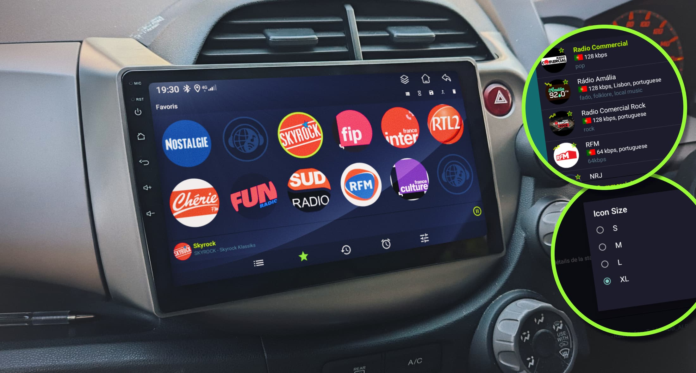

## Android radio streaming app based on [Radio Browser](http://www.radio-browser.info)

This is a fork of __RadioDroid__ focused on design improvements for larger screens. While it works great on any Android phone, it shines on larger displays like __Android car radios__ and head units.

The original app displayed elements too small for comfortable use on larger displays like my Android Head Unit. This fork addresses that with bigger icons, better scaling and a cleaner interface overall for all modern Android devices.

Whether you run it natively on an Android head unit or use it through __Android Auto__ from your phone, __RadioDroid__ is a great companion for your car.

---
### Changes

- Improved radios icons display in favorites
- Added adjustable icon size preference
- Circular indicator on currently playing station
- Dark theme set by default
- App logo used as fallback image when station has no icon
- Replaced tab titles with larger icons
- Android Auto support
- And various visual refinements ...

### Releases

Download signed release here [https://github.com/atika/RadioDroid/releases](https://github.com/atika/RadioDroid/releases)

### Original project

RadioDroid Original Project from [segler-alex](https://github.com/segler-alex/RadioDroid/), download releases [here](https://github.com/segler-alex/RadioDroid/releases), also available on [F-Droid](https://f-droid.org/repository/browse/?fdid=net.programmierecke.radiodroid2) and [Google Play](https://play.google.com/store/apps/details?id=net.programmierecke.radiodroid2).

	

